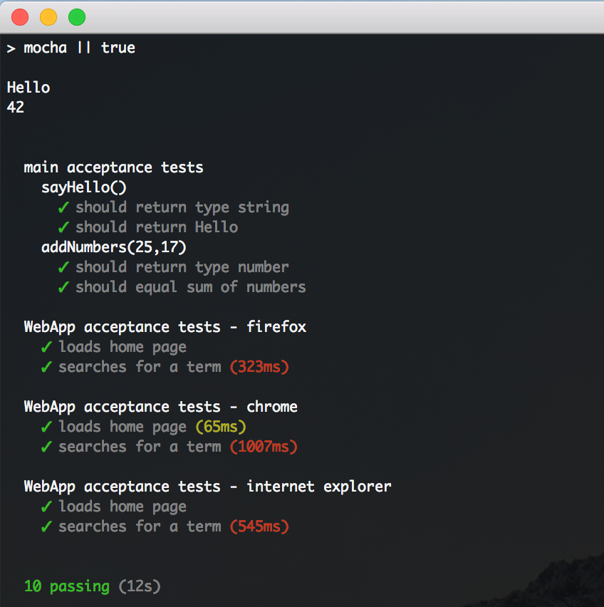

# Selenium with Mocha and Chai

Selenium tests with mocha and chai  

This application runs a test that opens a browser to Google, searches for selenium, waits for the title to change, then closes the browser.  


  
## Start

Start selenium-webdriver hub and node (this can be on the same or diferent computers)

- In this example selenium was installed on a Windows computer in `C:\Selenium` with all drivers extracted there as well

```shell
  # start hub
  java -jar selenium-server-standalone-3.0.0.jar -role hub
  # this will let you know where nodes should register e.g. Nodes should register to http://192.168.1.2:4444/grid/register/
  # start firefox node - could be on remote computer
  java -Dwebdriver.gecko.driver=C:\Selenium\geckodriver-v0.19.1-win32\geckodriver.exe -jar selenium-server-standalone-3.8.1.jar -role node -hub http://192.168.1.2:4444/grid/register
  # you should see the node registered to the hub e.g. Registered a node http://192.168.1.2:5555
  # start chrome node
  java -Dwebdriver.chrome.driver=C:\Selenium\chromedriver_win32\chromedriver.exe -jar selenium-server-standalone-3.8.1.jar -role node -hub http://192.168.1.2:4444/grid/register
  # OR start firefox & crhome node
  java -Dwebdriver.gecko.driver=C:\Selenium\geckodriver-v0.19.1-win32\geckodriver.exe -Dwebdriver.chrome.driver=C:\Selenium\chromedriver_win32\chromedriver.exe -jar selenium-server-standalone-3.8.1.jar -role node -hub http://192.168.1.2:4444/grid/register
  # OR start firefox, chrome, and ie nodes
  java -Dwebdriver.gecko.driver=C:\Selenium\geckodriver-v0.19.1-win32\geckodriver.exe -Dwebdriver.chrome.driver=C:\Selenium\chromedriver_win32\chromedriver.exe -Dwebdriver.iexplorer.driver=C:\Selenium\IEDriverServer_Win32_3.8.0\IEDriverServer.exe -jar selenium-server-standalone-3.8.1.jar -role node -hub http://192.168.1.2:4444/grid/register
```
  
Ensure node dependencies are installed by typing `npm install` OR `yarn`  
  
Run tests `npm run test`  
  
Start this application, type `npm start`  
  
To connect to the hub type `http://<ip address>:<port>/grid/console` in your browser (e.g. http://192.168.1.2:4444/grid/console)  
  
### Setup

This app was tested on Mac OS High Sierra controlling browsers running on a Windows computer  

- node 8.9.1  
- selenium-webdriver 3.8.1 (Selenium standalone server)  
- Browser drivers from http://www.seleniumhq.org/download/ (e.g. Firefox, Chrome, Internet Explorer, Edge, etc)  
- Java 1.8.0_131 (for hub and remote/local nodes)  

### Additional notes

If the node is on a different computer than the hub the selenium-webdriver (jar file) must be launched on both computers  
